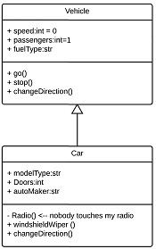

### [目次に戻る](../../README.md)
# 豆知識：アンプラグド・プログラミング
　PCを使わないプログラミングを指す言葉です．小学校のプログラミング教育でも採用されている方法です．  
　プログラミングというのは自身の考えをプログラミング言語に変換する作業です．「わかっているつもりでも人に説明しようとすると，全然わかっていなかった」なんてことがありませんでしたか？  この問題は「言語化」に慣れていないときに起きます．頭の中にある考えを紙に書き起こしてみたり，口に出したりすることを「言語化」といいます．  
　
  
　最初からプログラムに起こしづらかったら，紙にフローチャートや計算式を書いてみたり，人に相談してみましょう．

# クラス図
　プログラムを設計する際には，統一モデリング言語：UMLを使用する場合があります．そのUMLの中にクラス図というものがあります．クラスやオブジェクト指向についての理解の助けになるかと思います．調べてみましょう．

# クラス設計
　クラスの使い方は前回まででなんとなくわかってもらえたと思います．（文法は既存の教材で事足りるので教えるつもりはありません．下記サイトなどで学習してください）   

- [ロベールのＣ＋＋教室](http://www7b.biglobe.ne.jp/~robe/cpphtml/mainmenu.html)  

それでは，課題をやってもらおうと思います．　　

手元にある「正三角形導出プログラム」をクラス化してみましょう．  
頭を悩ませるような追加機能はないはずです．  

いくつかヒントを載せておきます．
ヒントなしでやりたい人がいそうなので，別ページです．  

仕様書は細かくなくても構いません．  
しかし，最低でも関数のどの引数が入力で，出力なのかわかるように設計しましょう．　　

### [ヒント](hint1.md)

### 機能の追加について
必要そうな機能があれば，どんどん追加して構いません．

- オフセット(ある方向にずらすこと)
- 面積計算
- 拡大，縮小
- 回転
- 重心計算
- 指定の形式で記述されたファイルストリームを引数としたコンストラクタ

| [前へ](6-2.md)_______________________________ |[章目次](6.md)| _______________________________[次へ](6-4.md) |
|:---|:---:|---:|

### [教材TOP](../../README.md)
　