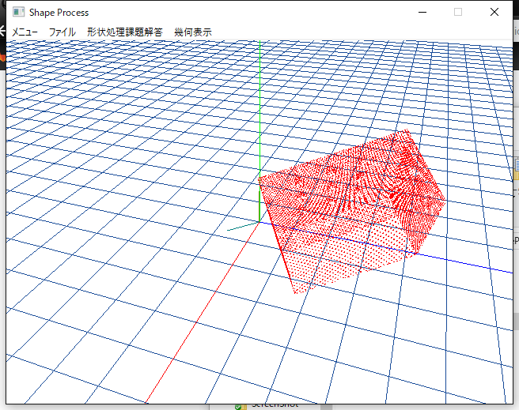

# はじめに
C++に関する基本知識は身につきましたか？  
あらかた身についていると思うので総合演習をやっていただきます．それが終われば，CAD/CAMなどで必要となる知識，形状処理の知識について勉強してもらいます．頑張りましょう．  

# 総合演習
下記に示す仕様を満たすようなプログラムを使用してください．

## 仕様
### 実行後の動作
- プログラムを実行すると，コンソール画面で入力待ちになる．
- 存在するファイル名を入力するとプログラムが動作する
	- 存在しないときは，再び入力待ちとなる．
- 決まったフォーマットに沿ったファイルを読み込むことができる．
	- ファイル拡張子は`*.txt`だけを受け付ける．
	- ファイル内には以下に挙げる[オブジェクト名]とそのデータが付随して記述
		- point, line, linestrip
		- オブジェクト名の前後は問わない(pointの次がline型でないと読み込めない仕様は避ける)

### プログラム仕様
- それぞれのオブジェクトに沿ったクラスを作成すること
- point, line, linestripは「Entity」クラスを継承すること
- Entityは抽象クラスであること
- Entityクラスの可変長配列を使用して下記のようなコードでオブジェクトの情報が表示されること

```
vector<Entity*> entities;

// point,lineなどのオブジェクトを作成して，entitiesに追加する関数
func(file_name, entities);

for(int i = 0; i < entities.size(); ++i){
	entities[i]->DisplayInfo();
}

```

### サンプルファイル
```entity.txt
[point]
1.5 2.5 6.0

[line]
3.0 4.0 0.0
5.0 5.0 0.0

[point]
0.0 0.0 0.0

[linestrip]
0 1 2
2 3 4
5 6 7
```

# 今後の使用について
上記で作成したプログラムを使って，点や線を読み込んで画面に表示するプログラムに利用しようと思います．


